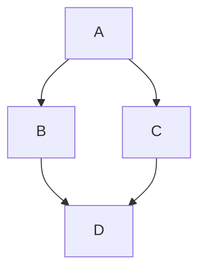

import Tabs from '@theme/Tabs';
import TabItem from '@theme/TabItem';

<Tabs>
<TabItem value="js" label="JavaScript">

```js
function helloWorld() {
  console.log('Hello, world!');
}
```

</TabItem>
<TabItem value="py" label="Python">

```py
def hello_world():
    // highlight-next-line
  print("Hello, world!")
```

</TabItem>
<TabItem value="java" label="Java">

```java showLineNumbers
class HelloWorld {
    // highlight-next-line
  public static void main(String args[]) {
    // highlight-next-line-error
    System.out.println("Hello, World");
  }
}
```

</TabItem>
</Tabs>

:::note

一些包含 _Markdown_ `语法` 的 **内容**。 看看[这个 `api`](#)。

:::

:::tip

一些包含 _Markdown_ `语法` 的 **内容**。 看看[这个 `api`](#)。

:::

:::info

一些包含 _Markdown_ `语法` 的 **内容**。 看看[这个 `api`](#)。

:::

:::caution

一些包含 _Markdown_ `语法` 的 **内容**。 看看[这个 `api`](#)。

:::

:::danger 呵呵

一些包含 _Markdown_ `语法` 的 **内容**。 看看[这个 `api`](#)。

:::

